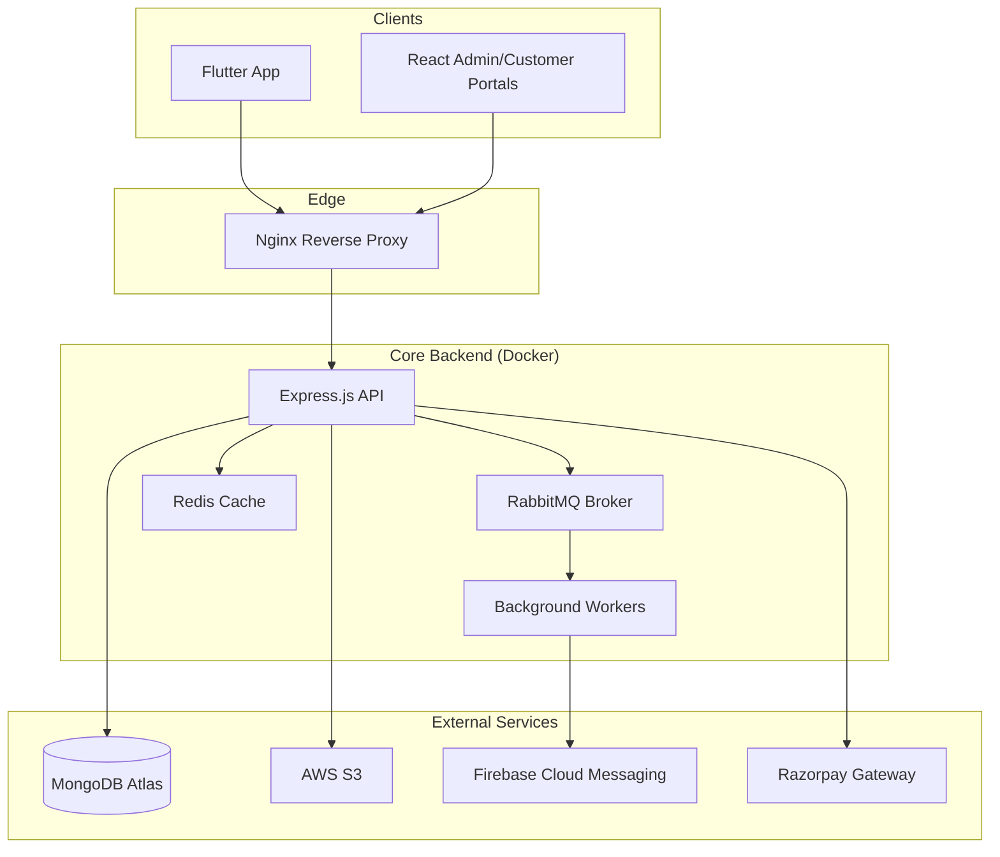

# 🍽️ CaterCraft - Full-Stack Catering Management Platform

[](https://github.com/nidhin29/catering-backend/actions/workflows/deploy.yml)

CaterCraft is a high-performance, scalable catering management ecosystem. It features a robust **Node.js** backend, a **Flutter** mobile application for staff/owners, and **dual React.js web portals** for comprehensive administration and customer booking.

---

## 🚀 Key Technological Highlights

### 📨 Event-Driven Architecture (RabbitMQ)
Offloaded all time-intensive tasks to background workers using **RabbitMQ**, ensuring sub-100ms API response times.
*   **Asynchronous Notifications**: Emails and FCM Push Notifications are queued and processed by background workers.
*   **Payment Resilience**: Razorpay webhooks are acknowledged immediately and processed asynchronously to prevent database locks.

### 🔐 Secure Communication Hub
*   **End-to-End Encryption (E2EE)**: Secure chat between owners and staff using client-side encryption.
*   **Real-time Synchronization**: Powered by **Socket.io** for instant booking status updates and live messaging.

### 💰 Financial Analytics & Platform Revenue
*   **Commission Engine**: Automated 10% platform commission calculation for every booking.
*   **Admin Dashboard**: Real-time earnings tracking and financial reporting using MongoDB aggregation pipelines.

### ☁️ Cloud Native & DevOps
*   **Dockerized Stack**: Entire backend, including Redis and RabbitMQ, is containerized for consistent environment deployment.
*   **CI/CD Pipeline**: Automated deployment to **AWS EC2** via **GitHub Actions**.
*   **Media Pipeline**: Direct-to-S3 uploads with optimized image processing.

---

## 🛠️ Tech Stack

| Category | Technology |
| :--- | :--- |
| **Backend** | Node.js, Express.js |
| **Database** | MongoDB (Mongoose) |
| **Caching** | Redis |
| **Messaging** | RabbitMQ (AMQP) |
| **Real-time** | Socket.io, Firebase Cloud Messaging (FCM) |
| **Payments** | Razorpay API |
| **Infrastructure** | AWS (EC2, S3), Nginx |
| **DevOps** | Docker, Docker Compose, GitHub Actions |

---

## 🏗️ System Architecture



---

## 🚀 Getting Started

### Prerequisites
*   Docker & Docker Compose
*   Node.js 20+ (for local development)
*   MongoDB Atlas Account
*   AWS S3 Bucket & IAM Credentials

### Local Development
1. **Clone & Install**
   ```bash
   git clone https://github.com/nidhin29/catering-backend.git
   cd catering-backend
   npm install
   ```

2. **Environment Configuration**
   Create a `.env` file based on `.env.example`:
   ```env
   PORT=8000
   MONGODB_URI=your_mongodb_uri
   REDIS_URL=redis://localhost:6379
   RABBITMQ_URL=amqp://localhost:5672
   AWS_ACCESS_KEY=...
   RAZORPAY_KEY_ID=...
   ```

3. **Run using Docker (Recommended)**
   ```bash
   docker compose up --build
   ```

---

## 🚢 Deployment (CI/CD)

This repository is configured with **GitHub Actions**. 

### Deployment Secrets
To enable automated deployment to AWS EC2, add the following secrets to your GitHub repository:
*   `HOST`: Your EC2 Public IP.
*   `USER`: `ubuntu`
*   `EC2_SSH_KEY`: Your `.pem` private key content.

---

## 👨‍💻 Developer
**Nidhin V Ninan**  
[GitHub](https://github.com/nidhin29) | [Portfolio](https://yourportfolio.com)
